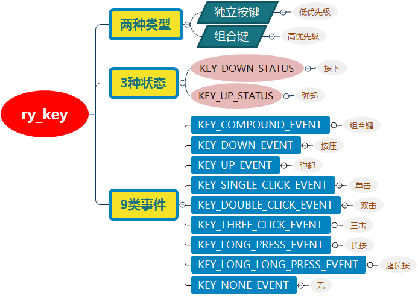
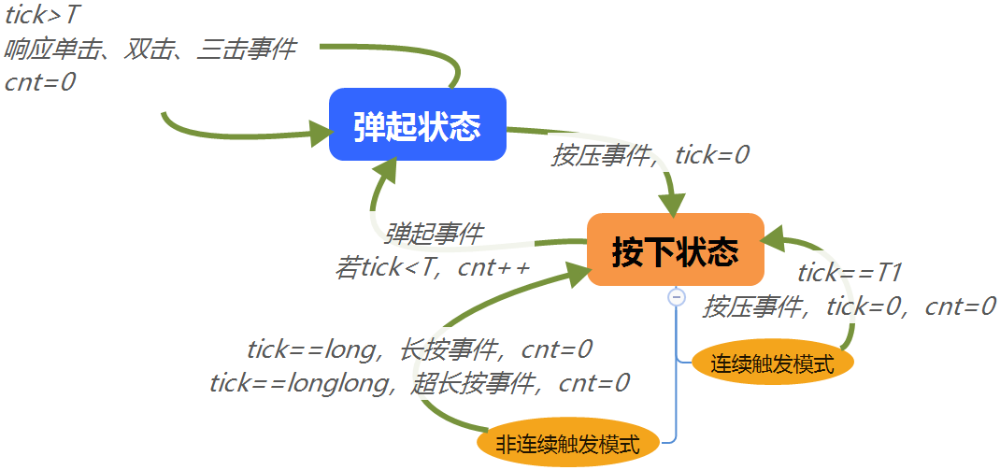
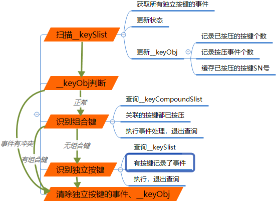

# ry_key  
# 概述  
嵌入式领域，C语言编写的按键驱动。  
* **两种类型**  
  * 独立按键  
  * 组合键  
* **4种状态**  
  `按下`、`弹起`、`空闲`  
* **9类事件**  
  `组合键`、`按压`、`弹起`、`单击`、`双击`、`三击`、`长按`、`超长按`、`无事件`  

 

*网盘下载地址：https://pan.baidu.com/s/1uoS-Xpm8JSPdkq5KYSMFFA?pwd=g1di*
---


# 数据结构  
## 独立按键  
 
## 组合键  
 


# 独立按键的状态机  
## 状态转移图  
 


# 按键扫描的具体流程  
 


# 如何使用  
建议使用一个定时器外设，配置成系统时基，定时调用`ry_key_scan`  


```
#include "ry_key.h"

static ry_key_t __keyPower;              /* 电源按键 */
static ry_key_t __keyCtr;                /* 控制按键 */
static ry_key_compound_t __compoundKey1; /* 组合键 */


extern uint8_t key_power_get_level(void);
extern uint8_t key_ctr_get_level(void);

void key_power_long_press_callback(ry_key_t *key)
{
	printf("key_power_long_press_callback");
}
void key_ctr_single_click_callback(ry_key_t *key)
{
	printf("key_ctr_single_click_callback");
}
void compound_key1_callback(ry_key_t *key)
{
	printf("compound_key1_callback");
}

void user_key_init(void)
{
	ry_key_reg(&__keyPower, 1, 5, 50, 300, 900, key_power_get_level);
	ry_key_reg(&__keyCtr,   1, 5, 50, 300, 900, key_ctr_get_level);
	ry_key_compound_reg(&__compoundKey1, compound_key1_callback);
	
	RY_KEY_CALLBACK_CFG(__keyPower, KEY_LONG_PRESS_EVENT, key_power_long_press_callback);
	RY_KEY_CALLBACK_CFG(__keyCtr, KEY_SINGLE_CLICK_EVENT, key_ctr_single_click_callback);
	
	ry_key_compound_insert_key_sn(&__compoundKey1, __keyPower.sn);
	ry_key_compound_insert_key_sn(&__compoundKey1, __keyCtr.sn);
}

int main(void)
{
	//system_init();
	user_key_init();
	while(1)
	{
		/* 配置定时器，定时扫描按键效果更好 */
		ry_key_scan();
	}
}
```

